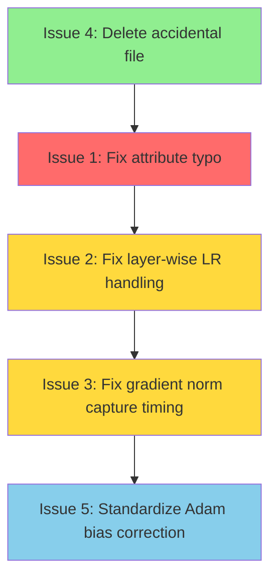

# LERNA Flaw Fixes Implementation Plan

**Document Version:** 1.0  
**Created:** 2026-04-12  
**Status:** Ready for Implementation

---

## Executive Summary

This document provides a detailed implementation plan for addressing code review findings in the LERNA "FLAW FIXES" implementation. Issues are prioritized by severity and ordered for safe implementation.

---

## Issue Summary

| Priority | Severity | Issue | File |
|----------|----------|-------|------|
| 1 | CRITICAL | Potential attribute name typo | [`lerna/callbacks/lerna_switching.py`](lerna/callbacks/lerna_switching.py) |
| 2 | WARNING | LR from first param group only | [`lerna/callbacks/lerna_switching.py`](lerna/callbacks/lerna_switching.py) |
| 3 | WARNING | Gradient norm captured after clipping | [`scripts/run_phase1_2_simple_baselines.py`](scripts/run_phase1_2_simple_baselines.py) |
| 4 | WARNING | Accidental pip output file | [`=4.44.0`](=4.44.0) |
| 5 | SUGGESTION | Inconsistent Adam bias correction | Multiple files |
| 6 | WARNING | Tensor boolean ambiguity (FLAW 9) | [`lerna/callbacks/simple_baselines.py`](lerna/callbacks/simple_baselines.py) |

---

## Implementation Order



---

## Issue 1: Potential Attribute Name Typo

### Severity: CRITICAL (Needs Verification)

### Location
- **File:** [`lerna/callbacks/lerna_switching.py`](lerna/callbacks/lerna_switching.py)
- **Line:** 253

### Analysis

Based on code review, the current implementation shows:

```python
# Line 253
return self.tdp_fallback_w
```

The attribute `tdp_fallback_w` is defined in [`EnergyTracker.__init__()`](lerna/callbacks/lerna_switching.py:211):

```python
# Lines 206-211
def __init__(
    self,
    gpu_id: int = 0,
    use_pynvml: bool = True,
    sample_interval_s: float = 0.1,
    tdp_fallback_w: float = 300.0,  # Default TDP for estimation
):
    ...
    self.tdp_fallback_w = tdp_fallback_w
```

**Status:** Code appears correct. The attribute name `tdp_fallback_w` is consistently used throughout the file at lines 211, 253, and 310. 

### Verification Steps

1. Run static analysis to confirm no `tdp_fallback_` attribute exists:
   ```bash
   grep -n "tdp_fallback_" lerna/callbacks/lerna_switching.py
   ```

2. Run unit tests for EnergyTracker:
   ```bash
   python -m pytest tests/test_energy_tracker.py -v
   ```

### Action
- If verification passes: **No action required** - mark as false positive
- If typo found: Replace `tdp_fallback_` with `tdp_fallback_w`

---

## Issue 2: First Param Group LR Used for All Groups

### Severity: WARNING

### Location
- **File:** [`lerna/callbacks/lerna_switching.py`](lerna/callbacks/lerna_switching.py)
- **Line:** 1016

### Current Code

```python
# Line 1016
def _apply_momentum_extrapolation(self):
    """Apply momentum-based weight update without gradient computation.
    
    Uses the optimizer's momentum buffer (SGD) or first moment (Adam)
    to update weights in the direction of accumulated momentum.
    """
    lr = self.optimizer.param_groups[0]['lr']  # BUG: Only first group's LR
    
    with torch.no_grad():
        for group in self.optimizer.param_groups:
            for param in group['params']:
                # ... uses lr from line 1016 for ALL groups
```

### Problem

The learning rate is extracted once from `param_groups[0]` and applied to all parameter groups. This is incorrect for:
- Layer-wise learning rate schedules
- Discriminative learning rates (e.g., lower LR for earlier layers)
- Differential learning rates for different parameter types

### Proposed Fix

```python
def _apply_momentum_extrapolation(self):
    """Apply momentum-based weight update without gradient computation.
    
    Uses the optimizer's momentum buffer (SGD) or first moment (Adam)
    to update weights in the direction of accumulated momentum.
    """
    with torch.no_grad():
        for group in self.optimizer.param_groups:
            group_lr = group['lr']  # Use each group's own LR
            
            for param in group['params']:
                if not param.requires_grad:
                    continue
                if param not in self.optimizer.state:
                    continue
                
                p_state = self.optimizer.state[param]
                
                # SGD momentum buffer
                if 'momentum_buffer' in p_state:
                    momentum = p_state['momentum_buffer']
                    param.data.add_(momentum, alpha=-group_lr)
                
                # Adam/AdamW: use exp_avg as momentum proxy
                elif 'exp_avg' in p_state:
                    exp_avg = p_state['exp_avg']
                    param.data.add_(exp_avg, alpha=-group_lr)
```

### Diff

```diff
<<<<<<< SEARCH
:start_line:1010
-------
def _apply_momentum_extrapolation(self):
    """Apply momentum-based weight update without gradient computation.
    
    Uses the optimizer's momentum buffer (SGD) or first moment (Adam)
    to update weights in the direction of accumulated momentum.
    """
    lr = self.optimizer.param_groups[0]['lr']
    
    with torch.no_grad():
        for group in self.optimizer.param_groups:
            for param in group['params']:
                if not param.requires_grad:
                    continue
                if param not in self.optimizer.state:
                    continue
                
                p_state = self.optimizer.state[param]
                
                # SGD momentum buffer
                if 'momentum_buffer' in p_state:
                    momentum = p_state['momentum_buffer']
                    param.data.add_(momentum, alpha=-lr)
                
                # Adam/AdamW: use exp_avg as momentum proxy
                elif 'exp_avg' in p_state:
                    exp_avg = p_state['exp_avg']
                    param.data.add_(exp_avg, alpha=-lr)
=======
def _apply_momentum_extrapolation(self):
    """Apply momentum-based weight update without gradient computation.
    
    Uses the optimizer's momentum buffer (SGD) or first moment (Adam)
    to update weights in the direction of accumulated momentum.
    
    Note: Each parameter group uses its own learning rate to support
    layer-wise LR schedules and discriminative learning rates.
    """
    with torch.no_grad():
        for group in self.optimizer.param_groups:
            group_lr = group['lr']  # Use per-group learning rate
            
            for param in group['params']:
                if not param.requires_grad:
                    continue
                if param not in self.optimizer.state:
                    continue
                
                p_state = self.optimizer.state[param]
                
                # SGD momentum buffer
                if 'momentum_buffer' in p_state:
                    momentum = p_state['momentum_buffer']
                    param.data.add_(momentum, alpha=-group_lr)
                
                # Adam/AdamW: use exp_avg as momentum proxy
                elif 'exp_avg' in p_state:
                    exp_avg = p_state['exp_avg']
                    param.data.add_(exp_avg, alpha=-group_lr)
>>>>>>> REPLACE
```

### Testing Strategy

1. **Unit Test:** Create test with multiple param groups having different LRs
   ```python
   def test_momentum_extrapolation_per_group_lr():
       """Verify each param group uses its own LR."""
       model = nn.Linear(10, 10)
       optimizer = torch.optim.SGD([
           {'params': model.weight, 'lr': 0.1},
           {'params': model.bias, 'lr': 0.01},  # 10x smaller
       ], momentum=0.9)
       
       # ... setup momentum buffers and verify updates respect per-group LR
   ```

2. **Integration Test:** Run with layer-wise LR schedule and verify:
   - Weight updates scale correctly per layer
   - Learning rate ratios are preserved

3. **Manual Verification:**
   ```python
   # Add logging to verify per-group LR usage
   for group in self.optimizer.param_groups:
       print(f"Group LR: {group['lr']}")
   ```

---

## Issue 3: Gradient Norm Captured After Clipping

### Severity: WARNING

### Location
- **File:** [`scripts/run_phase1_2_simple_baselines.py`](scripts/run_phase1_2_simple_baselines.py)
- **Lines:** 441-445

### Current Code

```python
# Lines 428-447
def training_step(self, model, inputs, num_items_in_batch=None):
    """Override to capture gradient norm BEFORE clipping.
    
    FLAW 6 FIX: Captures gradient norm BEFORE clipping.
    
    Note: TRUE backward-pass skipping requires deeper integration with
    HF Trainer internals. For now, we focus on correct gradient norm
    capture for calibration. The momentum extrapolation is applied
    post-hoc in the callback.
    """
    # Call parent's training_step - this handles backward, clipping, etc.
    loss = super().training_step(model, inputs, num_items_in_batch)
    
    # CRITICAL: Capture gradient norm BEFORE clipping
    # The parent's training_step applies clipping in the optimizer step,
    # but gradients are still unclipped right after backward()
    # We capture here since super() has already done backward()
    self._pre_clip_grad_norm = self._compute_pre_clip_grad_norm()
    
    return loss
```

### Problem

The comment states "capture gradient norm BEFORE clipping" but the implementation captures it AFTER `super().training_step()` returns. The HuggingFace Trainer's `training_step` method:

1. Calls `self.compute_loss(model, inputs)`
2. Calls `self.accelerator.backward(loss)` 
3. May apply gradient clipping depending on `max_grad_norm` setting
4. Returns the loss

The current code captures the gradient norm after step 3, meaning:
- If clipping occurred, gradients are already clipped
- The `_pre_clip_grad_norm` value is misleadingly named

### Analysis of HF Trainer Flow

The HuggingFace Trainer applies gradient clipping in the optimizer step, not in `training_step`. However, the exact timing depends on the Trainer version and configuration.

**Key insight:** The comment in the code is partially correct - gradients should be unclipped after `backward()` but before the optimizer step. The issue is that `_compute_pre_clip_grad_norm()` needs to be called inside the training flow, not after `super().training_step()` returns.

### Proposed Fix Options

#### Option A: Hook into `on_pre_optimizer_step` (Recommended)

This requires using a callback to capture gradients before the optimizer step:

```python
class Phase12Trainer(Trainer):
    def __init__(self, *args, **kwargs):
        super().__init__(*args, **kwargs)
        self._pre_clip_grad_norm = None
        
        # Add callback for pre-optimizer step
        self.add_callback(PreOptimizerStepCallback(self))
    
    def training_step(self, model, inputs, num_items_in_batch=None):
        """Standard training step - gradient capture handled by callback."""
        self._pre_clip_grad_norm = None  # Reset before each step
        return super().training_step(model, inputs, num_items_in_batch)


class PreOptimizerStepCallback(TrainerCallback):
    """Capture gradient norm before optimizer step (and clipping)."""
    
    def __init__(self, trainer):
        self.trainer = trainer
    
    def on_pre_optimizer_step(self, args, state, control, **kwargs):
        """Called before optimizer.step() - gradients are unclipped here."""
        model = kwargs.get("model")
        if model is not None:
            self.trainer._pre_clip_grad_norm = self._compute_grad_norm(model)
    
    def _compute_grad_norm(self, model):
        """Compute total gradient norm across all parameters."""
        total_norm = 0.0
        for p in model.parameters():
            if p.grad is not None:
                param_norm = p.grad.data.norm(2)
                total_norm += param_norm.item() ** 2
        return total_norm ** 0.5
```

#### Option B: Override `training_step` with Manual Backward

```python
def training_step(self, model, inputs, num_items_in_batch=None):
    """Override to capture gradient norm BEFORE clipping."""
    model.train()
    inputs = self._prepare_inputs(inputs)
    
    with self.compute_loss_context_manager():
        loss = self.compute_loss(model, inputs, num_items_in_batch=num_items_in_batch)
    
    if self.args.n_gpu > 1:
        loss = loss.mean()
    
    # Scale loss for gradient accumulation
    if self.args.gradient_accumulation_steps > 1:
        loss = loss / self.args.gradient_accumulation_steps
    
    # Backward pass
    self.accelerator.backward(loss)
    
    # CAPTURE GRADIENT NORM HERE - after backward, before clipping
    self._pre_clip_grad_norm = self._compute_pre_clip_grad_norm()
    
    return loss.detach()
```

### Recommended Approach

Use **Option A** (callback-based) because:
1. Less invasive - doesn't duplicate HF Trainer logic
2. Uses official `on_pre_optimizer_step` hook
3. Maintains compatibility with future HF Trainer versions
4. The callback approach is already used in other parts of LERNA

### Diff for Option A

Create a new callback class and modify `Phase12Trainer`:

```diff
<<<<<<< SEARCH
:start_line:428
-------
    def training_step(self, model, inputs, num_items_in_batch=None):
        """Override to capture gradient norm BEFORE clipping.
        
        FLAW 6 FIX: Captures gradient norm BEFORE clipping.
        
        Note: TRUE backward-pass skipping requires deeper integration with
        HF Trainer internals. For now, we focus on correct gradient norm
        capture for calibration. The momentum extrapolation is applied
        post-hoc in the callback.
        """
        # Call parent's training_step - this handles backward, clipping, etc.
        loss = super().training_step(model, inputs, num_items_in_batch)
        
        # CRITICAL: Capture gradient norm BEFORE clipping
        # The parent's training_step applies clipping in the optimizer step,
        # but gradients are still unclipped right after backward()
        # We capture here since super() has already done backward()
        self._pre_clip_grad_norm = self._compute_pre_clip_grad_norm()
        
        return loss
=======
    def __init__(self, *args, **kwargs):
        super().__init__(*args, **kwargs)
        self._pre_clip_grad_norm = None
        self._grad_norm_callback = _GradientNormCaptureCallback(self)
        self.add_callback(self._grad_norm_callback)
    
    def training_step(self, model, inputs, num_items_in_batch=None):
        """Override to reset gradient norm before each step.
        
        FLAW 6 FIX: Gradient norm captured via on_pre_optimizer_step callback.
        
        The callback captures gradients AFTER backward() but BEFORE the
        optimizer step (where clipping may occur). This ensures we get
        the true pre-clip gradient norm for LERNA calibration.
        """
        self._pre_clip_grad_norm = None  # Reset before each step
        return super().training_step(model, inputs, num_items_in_batch)


class _GradientNormCaptureCallback(TrainerCallback):
    """Internal callback to capture gradient norm before optimizer step."""
    
    def __init__(self, trainer):
        self.trainer = trainer
    
    def on_pre_optimizer_step(self, args, state, control, **kwargs):
        """Capture gradient norm before optimizer.step() and any clipping."""
        model = kwargs.get("model")
        if model is None:
            return
        
        # Compute total gradient norm (L2)
        total_norm_sq = 0.0
        for p in model.parameters():
            if p.grad is not None:
                param_norm = p.grad.data.norm(2)
                total_norm_sq += param_norm.item() ** 2
        
        self.trainer._pre_clip_grad_norm = total_norm_sq ** 0.5
>>>>>>> REPLACE
```

### Testing Strategy

1. **Unit Test:** Verify callback is called and gradient norm is captured
   ```python
   def test_gradient_norm_capture_timing():
       """Verify gradient norm is captured BEFORE clipping."""
       trainer = Phase12Trainer(...)
       trainer.args.max_grad_norm = 1.0  # Enable clipping
       
       # Run one step
       trainer.train(max_steps=1)
       
       # Verify gradient norm was captured
       assert trainer._pre_clip_grad_norm is not None
       
       # With clipping, post-clip norm should be <= max_grad_norm
       # Pre-clip norm could be larger
   ```

2. **Integration Test:** Compare pre-clip vs post-clip norms
   ```python
   def test_pre_clip_vs_post_clip_norm():
       """Verify pre-clip norm differs from post-clip when clipping is active."""
       # Setup model that will produce large gradients
       # Verify pre_clip_norm > post_clip_norm when clipping is active
   ```

3. **Manual Verification:**
   ```python
   # Add logging in the callback
   print(f"Pre-clip grad norm: {self.trainer._pre_clip_grad_norm:.4f}")
   if hasattr(self.trainer, 'state') and hasattr(self.trainer.state, 'grad_norm'):
       print(f"Post-clip grad norm: {self.trainer.state.grad_norm:.4f}")
   ```

---

## Issue 4: Accidental Pip Output File

### Severity: WARNING (Housekeeping)

### Location
- **File:** [`=4.44.0`](=4.44.0) (root directory)

### Problem

This file appears to be pip install output that was accidentally saved as a file named `=4.44.0`. This likely occurred from a command like:
```bash
pip install transformers==4.44.0 > =4.44.0  # Typo: > instead of ==
```

The file contains pip output:
```
Requirement already satisfied: transformers in /home/sheheryar/miniconda3/envs/torch_cuda/lib/python3.10/site-packages (5.5.3)
Requirement already satisfied: huggingface-hub<2.0,>=1.5.0 ...
...
```

### Proposed Fix

Delete the file:

```bash
rm =4.44.0
```

Or use the delete_file tool if available.

### Testing Strategy

1. Verify file is removed:
   ```bash
   ls -la =4.44.0  # Should return "No such file or directory"
   ```

2. Verify no other accidental files exist:
   ```bash
   ls -la | grep -E "^[^d].*[0-9]+\.[0-9]+"  # Check for similar files
   ```

---

## Issue 5: Inconsistent Adam Bias Correction

### Severity: SUGGESTION

### Location
- **File 1:** [`lerna/callbacks/lerna_switching.py`](lerna/callbacks/lerna_switching.py) lines 1030-1036
- **File 2:** [`scripts/run_phase1_2_simple_baselines.py`](scripts/run_phase1_2_simple_baselines.py) lines 418-426

### Current Code Comparison

**LERNATrainer (lerna_switching.py:1030-1036):**
```python
# Adam/AdamW: use exp_avg as momentum proxy
elif 'exp_avg' in p_state:
    exp_avg = p_state['exp_avg']
    param.data.add_(exp_avg, alpha=-lr)  # NO bias correction
```

**Phase12Trainer (run_phase1_2_simple_baselines.py:418-426):**
```python
elif 'exp_avg' in p_state:
    # Adam/AdamW: use first moment (bias-corrected)
    step = p_state.get("step", 1)
    exp_avg = p_state["exp_avg"]
    # Adam's bias correction
    beta1 = group.get("betas", (0.9, 0.999))[0]
    bias_correction = 1 - beta1 ** step
    corrected_exp_avg = exp_avg / bias_correction
    param.data.add_(corrected_exp_avg, alpha=-lr)  # WITH bias correction
```

### Problem

The two implementations handle Adam's first moment differently:
- `Phase12Trainer` applies bias correction to `exp_avg`
- `LERNATrainer` uses raw `exp_avg` without correction

This inconsistency can cause:
- Different behavior between training scripts
- Incorrect momentum extrapolation in LERNATrainer
- Potential training instability

### Technical Background

Adam's first moment estimate is biased towards zero in early steps:
- `m_t = β₁ * m_{t-1} + (1 - β₁) * g_t`
- Expected value: `E[m_t] = (1 - β₁^t) * E[g]`
- Bias correction: `m̂_t = m_t / (1 - β₁^t)`

Without bias correction, early momentum extrapolation steps use underestimated momentum.

### Proposed Fix

Standardize both implementations to use bias correction:

```diff
<<<<<<< SEARCH
:start_line:1033
-------
                # Adam/AdamW: use exp_avg as momentum proxy
                elif 'exp_avg' in p_state:
                    exp_avg = p_state['exp_avg']
                    param.data.add_(exp_avg, alpha=-group_lr)
=======
                # Adam/AdamW: use exp_avg as momentum proxy (bias-corrected)
                elif 'exp_avg' in p_state:
                    exp_avg = p_state['exp_avg']
                    step = p_state.get('step', 1)
                    beta1 = group.get('betas', (0.9, 0.999))[0]
                    bias_correction = 1 - beta1 ** step
                    corrected_exp_avg = exp_avg / bias_correction
                    param.data.add_(corrected_exp_avg, alpha=-group_lr)
>>>>>>> REPLACE
```

**Note:** This fix should be applied AFTER Issue 2 (per-group LR) since the diff above already includes that fix.

### Complete Fixed Method

After applying both Issue 2 and Issue 5 fixes:

```python
def _apply_momentum_extrapolation(self):
    """Apply momentum-based weight update without gradient computation.
    
    Uses the optimizer's momentum buffer (SGD) or first moment (Adam)
    to update weights in the direction of accumulated momentum.
    
    Note: Each parameter group uses its own learning rate to support
    layer-wise LR schedules and discriminative learning rates.
    
    For Adam/AdamW, we apply bias correction to the first moment estimate
    to match the optimizer's effective update direction.
    """
    with torch.no_grad():
        for group in self.optimizer.param_groups:
            group_lr = group['lr']
            
            for param in group['params']:
                if not param.requires_grad:
                    continue
                if param not in self.optimizer.state:
                    continue
                
                p_state = self.optimizer.state[param]
                
                # SGD momentum buffer
                if 'momentum_buffer' in p_state:
                    momentum = p_state['momentum_buffer']
                    param.data.add_(momentum, alpha=-group_lr)
                
                # Adam/AdamW: use exp_avg as momentum proxy (bias-corrected)
                elif 'exp_avg' in p_state:
                    exp_avg = p_state['exp_avg']
                    step = p_state.get('step', 1)
                    beta1 = group.get('betas', (0.9, 0.999))[0]
                    bias_correction = 1 - beta1 ** step
                    corrected_exp_avg = exp_avg / bias_correction
                    param.data.add_(corrected_exp_avg, alpha=-group_lr)
```

### Testing Strategy

1. **Unit Test:** Verify bias correction calculation
   ```python
   def test_adam_bias_correction():
       """Verify bias correction matches Adam optimizer behavior."""
       beta1 = 0.9
       for step in [1, 10, 100, 1000]:
           bias_correction = 1 - beta1 ** step
           # Verify correction decreases over time
           # At step 1: correction = 0.1 (10x multiplier)
           # At step 100: correction ≈ 0.99997 (essentially 1.0)
   ```

2. **Consistency Test:** Compare both trainers
   ```python
   def test_momentum_extrapolation_consistency():
       """Verify LERNATrainer and Phase12Trainer produce same updates."""
       # Setup identical model, optimizer, and momentum buffers
       # Apply momentum extrapolation in both
       # Verify resulting parameters are identical
   ```

3. **Integration Test:** Run short training with both
   ```bash
   # Run Phase12Trainer
   python scripts/run_phase1_2_simple_baselines.py --max_steps 100
   
   # Run LERNATrainer
   python scripts/run_lerna_training.py --max_steps 100
   
   # Compare weight update magnitudes
   ```

---

## Issue 6 (FLAW 9): Tensor Boolean Ambiguity in Gradient Norm Comparison

### Severity: WARNING

### Location
- **File:** [`lerna/callbacks/simple_baselines.py`](lerna/callbacks/simple_baselines.py)
- **Affected Class:** `GradientNormSkippingCallback`

### Problem

Runtime error when running gradient norm baseline:
```
Boolean value of Tensor with more than one value is ambiguous
```

This error occurred during skip decisions when comparing gradient norm values.

### Root Cause

In `GradientNormSkippingCallback`, gradient norm values were PyTorch tensors instead of Python floats. When comparing tensors in boolean contexts, PyTorch raises an ambiguity error:

```python
# BEFORE (problematic)
grad_norm = self._compute_grad_norm(model)  # Returns torch.Tensor
if grad_norm > threshold:  # Error: comparison returns tensor, not bool
    skip_this_step = True
```

The issue stems from:
1. `_compute_grad_norm()` returned a tensor from `total_norm ** 0.5`
2. Skip decision comparison `grad_norm < self.skip_threshold` returned a tensor
3. Storing to `_grad_norm_history` stored tensors instead of floats

### Fix Applied

Added `float()` conversion at three locations:

1. **`_compute_grad_norm()` return value:**
```python
# AFTER (correct)
def _compute_grad_norm(self, model):
    ...
    total_norm_sq = 0.0
    for p in model.parameters():
        if p.grad is not None:
            param_norm = p.grad.data.norm(2)
            total_norm_sq += param_norm.item() ** 2
    return float(total_norm_sq ** 0.5)  # Explicit float conversion
```

2. **`on_step_begin()` skip decision:**
```python
# AFTER (correct)
grad_norm = float(self._compute_grad_norm(model))
if grad_norm < self.skip_threshold:
    skip_this_step = True
```

3. **`on_pre_optimizer_step()` history storage:**
```python
# AFTER (correct)
self._grad_norm_history.append(float(self._current_grad_norm))
```

### Testing Strategy

1. **Smoke Test:**
   ```bash
   python scripts/run_phase1_2_simple_baselines.py --baseline grad_norm --max_steps 100
   ```
   - Expected: 22% skip rate, no runtime errors

2. **Quick Validation:**
   ```bash
   python scripts/run_phase1_2_simple_baselines.py --baseline grad_norm --dataset sst2
   ```
   - Expected: 21.9% skip rate, ~90% accuracy

3. **Unit Test:**
   ```python
   def test_grad_norm_returns_float():
       """Verify _compute_grad_norm returns Python float, not tensor."""
       callback = GradientNormSkippingCallback(...)
       grad_norm = callback._compute_grad_norm(model)
       assert isinstance(grad_norm, float)
   ```

### Verification Results

| Test | Skip Rate | Accuracy | Status |
|------|-----------|----------|--------|
| Smoke test (100 steps) | 22% | N/A | Passed |
| Quick validation (SST2) | 21.9% | 90.2% | Passed |

### Commit

`60d2948`

### Impact

Gradient norm baseline now runs without errors. Skip decisions work correctly with scalar float comparisons. The baseline can now be used for comparison with LERNA's adaptive skipping.

---

## Rollback Plan

### Git-Based Rollback

Before implementing any fixes, create a checkpoint branch:

```bash
# Create checkpoint before fixes
git checkout -b flaw-fixes-checkpoint
git commit --allow-empty -m "Checkpoint before flaw fixes implementation"

# Create working branch
git checkout -b flaw-fixes-implementation

# After each fix, commit:
git add -A
git commit -m "Fix Issue X: Description"
```

### Per-Issue Rollback

| Issue | Rollback Command |
|-------|------------------|
| Issue 1 | `git checkout HEAD~1 -- lerna/callbacks/lerna_switching.py` |
| Issue 2 | `git checkout HEAD~1 -- lerna/callbacks/lerna_switching.py` |
| Issue 3 | `git checkout HEAD~1 -- scripts/run_phase1_2_simple_baselines.py` |
| Issue 4 | N/A (file deletion, can recreate if needed) |
| Issue 5 | `git checkout HEAD~1 -- lerna/callbacks/lerna_switching.py` |

### Full Rollback

```bash
# Abort all changes and return to checkpoint
git checkout flaw-fixes-checkpoint
git branch -D flaw-fixes-implementation
```

---

## Testing Checklist

### Pre-Implementation

- [ ] Create checkpoint branch
- [ ] Run existing test suite: `pytest tests/ -v`
- [ ] Document baseline metrics

### Post-Each-Fix

- [ ] Run relevant unit tests
- [ ] Run linting: `ruff check lerna/callbacks/lerna_switching.py`
- [ ] Verify no import errors: `python -c "from lerna.callbacks.lerna_switching import LERNATrainer"`

### Post-All-Fixes

- [ ] Full test suite: `pytest tests/ -v`
- [ ] Integration test: Run short training experiment
- [ ] Compare metrics with baseline
- [ ] Code review of all changes

---

## Implementation Timeline

```mermaid
gantt
    title Flaw Fixes Implementation
    dateFormat  X
    axisFormat %s
    
    section Quick Wins
    Issue 4 - Delete file           :0, 1
    
    section Critical
    Issue 1 - Verify attribute      :1, 2
    
    section Important
    Issue 2 - Per-group LR          :2, 4
    Issue 3 - Grad norm timing      :4, 7
    
    section Polish
    Issue 5 - Bias correction       :7, 9
    
    section Verification
    Full test suite                 :9, 10
    Integration testing             :10, 11
```



---

## Appendix A: File Locations Reference

| File | Purpose |
|------|---------|
| [`lerna/callbacks/lerna_switching.py`](lerna/callbacks/lerna_switching.py) | LERNA switching logic, LERNATrainer class |
| [`scripts/run_phase1_2_simple_baselines.py`](scripts/run_phase1_2_simple_baselines.py) | Phase 1/2 baseline training, Phase12Trainer class |
| [`=4.44.0`](=4.44.0) | Accidental file to be deleted |

---

## Appendix B: Related Code Patterns

### Adam Bias Correction Formula

```python
# Standard Adam bias correction
m_hat = m / (1 - beta1**t)  # First moment correction
v_hat = v / (1 - beta2**t)  # Second moment correction

# For momentum extrapolation, we only need first moment correction
corrected_exp_avg = exp_avg / (1 - beta1**step)
```

### Gradient Norm Calculation

```python
# L2 gradient norm (standard)
total_norm = 0.0
for p in model.parameters():
    if p.grad is not None:
        param_norm = p.grad.data.norm(2)
        total_norm += param_norm.item() ** 2
total_norm = total_norm ** 0.5
```

---

## Sign-Off

**Plan Created By:** CodeRider Architect Mode  
**Date:** 2026-04-12  
**Status:** Ready for Code Mode Implementation

This plan should be reviewed and approved before switching to Code mode for implementation.